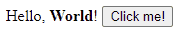

# Getting Started with Elmish

## Requisite tools

Elmish is a PureScript library, and PureScript works with
[NodeJS](https://nodejs.org/en/download/), and that's pretty much the only tool
you'll need to install upfront.

## Initialize an empty project

First, create a directory and set up the tool chain in it:

1. Create an empty directory
2. Run `npm init` to initialize a new Node project in the directory. This will
   ask you a bunch of questions, but you can just hit Enter to all of them,
   they're not important. The result should be a lone `package.json` file in the
   directory.
3. Run `npm install --save purescript spago react react-dom esbuild` to install:
    * `purescript` - the PureScript compiler.
    * `spago` - [the PureScript package manager](https://github.com/purescript/spago).
    * `react` and `react-dom` - the React library, on which Elmish is based.
    * `esbuild` - the fastest JavaScript bundle currently available.
4. Run `npx spago init` to initialize a new PureScript project in the directory.
   This should create a bit of scaffolding, including a couple of `*.dhall` files
   and an `src` directory with `Main.purs` in it.
5. Run `npx spago install elmish elmish-html` to install the Elmish library and
   its companion `elmish-html`.

Now that you have the barebones project, add a way to run and test it:

1. Using your favourite text editor, create a file named `index.html` and put
   the following code in it:

   ```html
    <div id="app">The UI is not here yet</div>
    <script src="output/index.js"></script>
    <script>window.Main.main()</script>
   ```

   The first line is the container for the application to render itself in. The
   second line references the JavaScript bundle (result of your code
   compilation). The third line invokes the PureScript entry point function.

2. Open `package.json`, find the `scripts` section in it, and add the following line:

   ```json
   "start": "spago build && esbuild ./output/Main/index.js --bundle --serve --servedir=. --outfile=output/index.js --global-name=Main"
   ```

   This command first builds your project (via `spago build`) and then starts
   the `esbuild` bundler to bundle the compilation results and simultaneously
   serve them with a built-in web server.

3. To verify, run `npm start`. This should, after a few seconds, display
   something along the lines of:

   ```text
   Local: http://127.0.0.1:8000/
   ```

   Open that address in a browser. You should see text "_The UI is not here
   yet_". If you don't see that, something is wrong with the setup so far.

## Hello World

To start your Elmish UI, first you'll need to define the five elements, as
explained in [the overview](index.md), - `State`, `Message`, `init`, `update`,
and `view`. We're going to put all of this in `Main.purs`:

```haskell
-- Nothing happens in our UI so far, so there are no messages
data Message

-- The UI is just static text, so there is no state
type State = Unit

-- Since there is no state, there is nothing to initialize
init :: Transition Message State
init = pure unit

-- Since there are no messages, the `update` function is also trivial
update :: State -> Message -> Transition Message State
update _ _ = pure unit

view :: State -> Dispatch Message -> ReactElement
view _ _ =
   H.div {}
   [ H.text "Hello, "
   , H.strong {} "World!"
   ]
```

To make that compile, you'll need the following imports:

```haskell
import Elmish (Transition, Dispatch, ReactElement)
import Elmish.HTML as H  -- This is more convenient to import qualified
import Elmish.Boot (defaultMain) -- We'll need this in a moment
```

Now all that remains is hook that up to the entry point. To do that, put the
following in `main`:

```haskell
main :: Effect Unit
main = defaultMain { def: { init, view, update }, elementId: "app" }
```

Now save and refresh your browser (assuming you still have `npm start` running).
You should see "Hello, **World!**" on the screen.

## Interaction

Now let's add some interaction. We'll do the simplest kind for now: a button
click. To do that, we'll need a message to describe the click:

```haskell
data Message = ButtonClicked
```

And in order for the button to have a visible effect, we'll add some state for
it to change:

```haskell
type State = { word :: String }
```

The `init` function should change accordingly:

```haskell
init :: Transition Message State
init = pure { word: "World" }
```

And the `update` function should react to the button click by updating the
state:

```haskell
update :: State -> Message -> Transition Message State
update state ButtonClicked = pure state { word = "Elmish" }
```

And finally, the `view` function should add a button:

```haskell
view :: State -> Dispatch Message -> ReactElement
view state dispatch =
   H.div {}
   [ H.text "Hello, "
   , H.strong {} state.word
   , H.text "! "
   , H.button { onClick: dispatch ButtonClicked } "Click me!"
   ]
```

If you refresh your browser now, you should see this:


