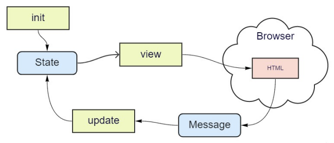

# Intro

Elmish is a PureScript UI library that (loosely) follows [The Elm
Architecture](https://guide.elm-lang.org/architecture/) and implemented as a
thin layer on top of React. Unlike Elm itself, Elmish allows arbitrary
side-effects, including running them in a custom monad.

## The Elm Architecture

In short, the idea is that your UI consists of:

* "state" - a data structure that describes what the UI looks like and what it
  can do.
* "view" - a function that can take the "state" and produce some HTML from it.
* "message" - a description of something happening in the UI, such as a button click or
  a timer firing. There is generally a finite set of possible messages for a given UI
  component.
* "update" - a function that can take the current "state" and a "message", and figure out
  what the new state should be as a result of receiving that message.
* "init" - a way to create initial "state".

